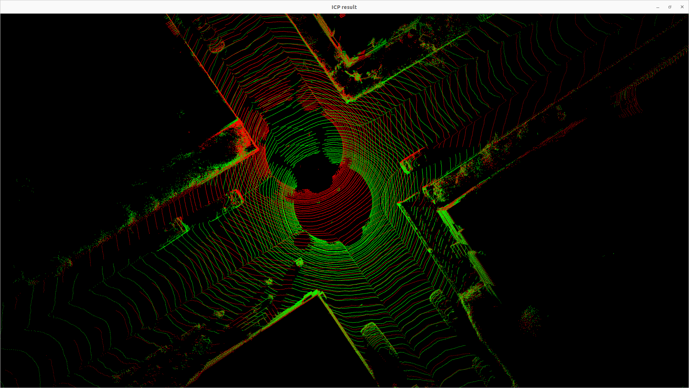

# ICP-Implementation
This repository implements ICP, Point-to-Plane ICP, and G-ICP algorithms.

This repository utilizes the Open3D library for PointCloud processing and Ceres-Solver for Nonlinear Optimization.
## References

- ICP Algorithm : [Least-Squares Rigid Motion Using SVD](https://igl.ethz.ch/projects/ARAP/svd_rot.pdf) by Olga Sorkine-Hornung and Michael Rabinovich.

- ICP(point to plane) Algorithm : [Linear Least-Squares Optimization for Point-to-Plane ICP Surface Registration](https://www.comp.nus.edu.sg/~lowkl/publications/lowk_point-to-plane_icp_techrep.pdf) by Kok-Lim Low.

- GICP Algorithm : [Generalized-ICP](https://www.roboticsproceedings.org/rss05/p21.pdf) by Aleksandr V. Segal, Dirk Haehnel and Sebastian Thrun.
## Dependencies

- Ubuntu
- [Open3D](http://www.open3d.org/)
- [Ceres-Solver](http://ceres-solver.org/)


## Build

```bash
git clone https://github.com/LimHaeryong/ICP-Implementation.git

cd ICP-Implementation
mkdir build && cd build
cmake -DCMAKE_BUILD_TYPE=Release ..
make -j$(nproc)
```

## Examples

Demonstrates the basic usage of the ICP algorithm. Additionally, compares the results with Open3D's ICP implementation for performance evaluation.

1. ICP example
```
./icp_example 
```

2. Point to Plane ICP example
```
./icp_plane_example
```

3. Generalized ICP example
```
./gicp_example
```

## Result



## Dataset

The [KITTI dataset](http://www.cvlibs.net/datasets/kitti/) has been utilized in the examples provided in this repository. 
